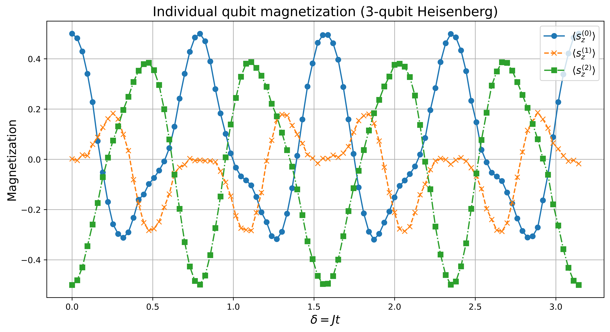
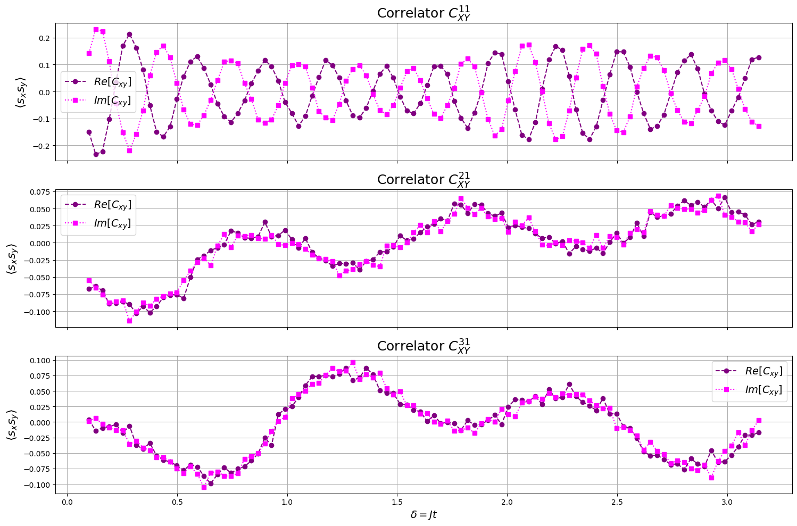
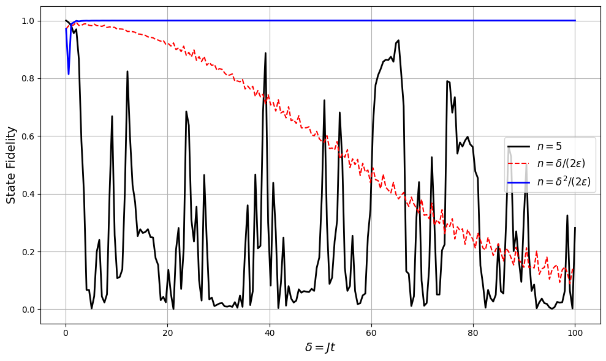

# Digital Quantum Simulations

  
  
  

**PHYS-451 semester project: EPFL**

Project in Quantum computing for spin models. We wish to simulate dynamics of physical systems using quantum circuits, which is done by digital quantum simulation of interacting spin models using IBM-Q.

In this project, we will explore digital quantum simulation by simulating Schrödinger's equation using a quantum algorithm that is running on a quantum computer. The build will consist of only universal quantum gates. We wish to implement digital simulations of the time evolution of the two- and three-spin Heisenberg models, then use QASM simulation to find estimates of observables of the system, and in the end investigate the effect of noise and origins of errors.
 
